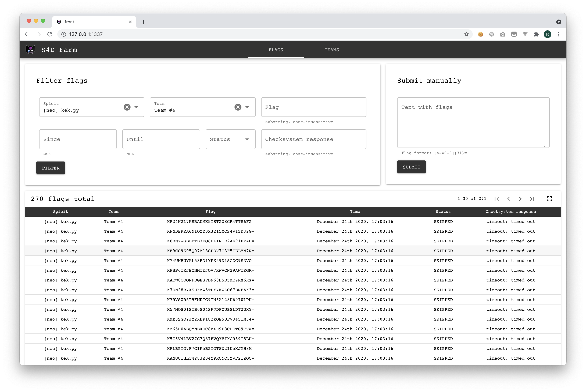
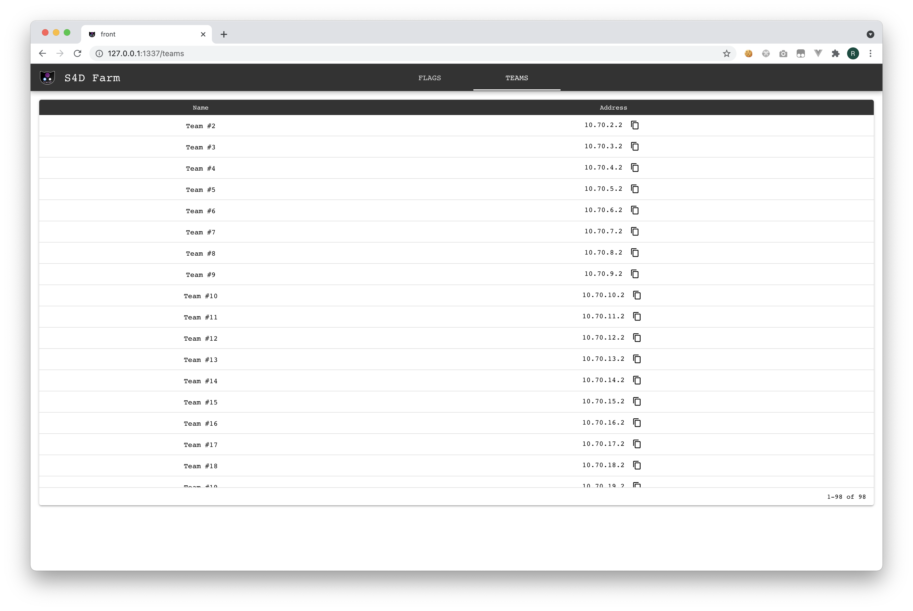

# S4DFarm

This is a fork of [DestructiveFarm](https://github.com/DestructiveVoice/DestructiveFarm), 
rewritten by the C4T BuT S4D team over the years.

## Running:
- Change the [./server/app/config.py](./server/app/config.py) file to your liking
    (don't forget to change the `SERVER_PASSWORD`).
- Change external_redis password in docker-compose.yml (of you're planning to use it).
- `docker compose up --build -d`
- **GLHF**

Some screenshots:

